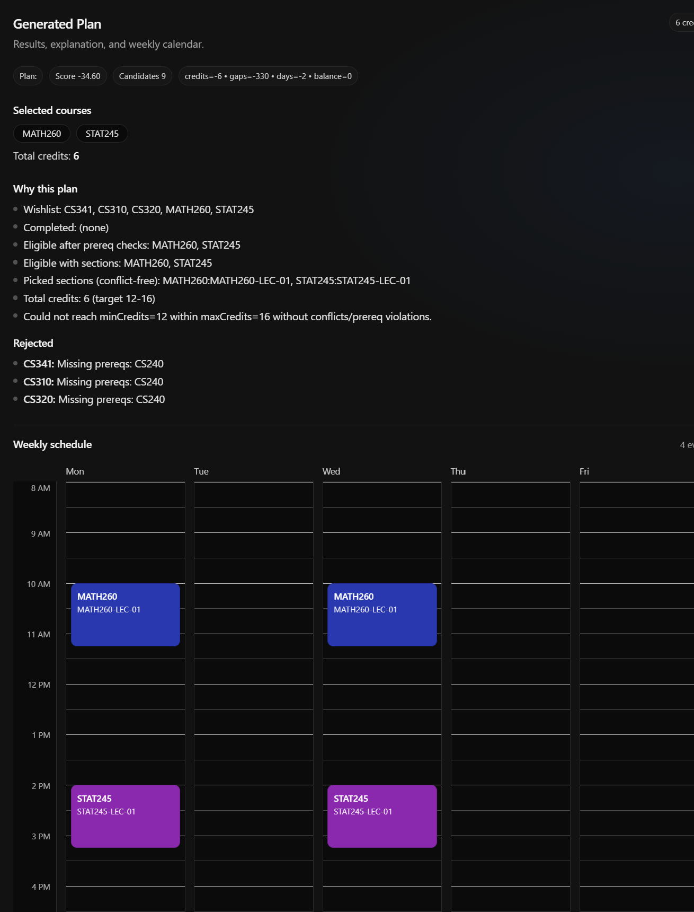

# CoursePlan Scheduler

**CoursePlan Scheduler** is a deterministic course scheduling system that generates a **conflict-free weekly plan** from a student’s wishlist, completed courses, and credit constraints.  
It operates on **real section meeting times**, enumerates valid schedules using backtracking, and selects the best plan using a **deterministic scoring system**.

The project is implemented as a **pnpm monorepo** with a TypeScript Express API, a React + Vite frontend, and a shared scheduling/scoring package.

---

## Demo (What the user sees)

- Browse available courses loaded from the API
- Add/remove courses from a wishlist
- Mark completed courses by course code
- Set minimum and maximum credit constraints
- Generate a schedule with one click
- View:
  - selected courses and sections
  - total credits
  - overall score and score breakdown
  - textual explanation of why the plan was chosen
  - rejected courses with explicit reasons
- Toggle a **read-only weekly calendar** (Mon–Fri, 8am–8pm) showing the final schedule visually

---

## Repository Structure (pnpm monorepo)

```text
courseplan-scheduler/
├── apps/
│   ├── api/                  # Express API (TypeScript, ts-node-dev)
│   └── web/                  # Vite + React + TypeScript frontend
│
├── packages/
│   └── shared/               # Shared types/utils/scheduling/scoring
│       └── dataset/
│           └── data/
│               └── courses.sample.json
│
├── pnpm-workspace.yaml
└── package.json
```
### Key packages

- **apps/api**  
  Express server exposing course data and plan generation endpoints.

- **apps/web**  
  Frontend UI for building a wishlist, generating a plan, and visualizing the weekly schedule.

- **packages/shared**  
  Core domain logic:
  - shared TypeScript types
  - prerequisite validation
  - conflict detection
  - backtracking candidate generation
  - deterministic scoring

---

## Core Scheduling Features (Phase A)

The scheduler enforces **hard constraints first** before any optimization occurs.

### Implemented constraints

- **Prerequisite checking**
  - Courses are excluded if prerequisites are not satisfied by completed courses.

- **Completed course filtering**
  - Courses already completed cannot be selected again.

- **Credit constraints**
  - Enforces `minCredits` and `maxCredits`.

- **Section-level conflict detection**
  - Conflicts are checked using real section meeting times.
  - Conflicts are detected at the **section level**, not course level.

- **Backtracking candidate generation**
  - Valid schedules are generated via backtracking.
  - Often produces **50+ candidate schedules** depending on input.

### Time representation

Sections define meeting times using `timeSlots`:

```ts
timeSlots: [
  {
    day: "Mon" | "Tue" | "Wed" | "Thu" | "Fri",
    startMin: number, // minutes since midnight
    endMin: number
  }
]
```

## Optimization & Scoring (Phase B)

Once valid schedules are generated, they are **ranked deterministically**.

### Lexicographic objective (IMPORTANT)

> **Schedules that meet `minCredits` are always preferred if any exist.**  
> Scoring is used **only as a tie-breaker** among schedules that satisfy this condition.

⚠️ The frontend UI **assumes this behavior**, so it is a core design rule.

### Scoring criteria

Among eligible schedules, scoring considers:

- **Credits vs `minCredits`**
- **Idle gaps** (total idle minutes between classes)
- **Number of days used**
- **Daily balance** (distribution of classes across days)

### Deterministic behavior

- Given the same input, the same plan is always selected.
- No randomness is used during scoring or selection.

---

## Generated Plan Output

The API returns a fully explained plan object:

```ts
GeneratedPlan {
  planId: string
  selectedCourseCodes: string[]
  selectedSections: {
    courseCode: string
    sectionId: string
  }[]
  totalCredits: number
  score: number
  scoreBreakdown: Record<string, number>
  explanation: string[]
  rejected: {
    courseCode: string
    reason: string
  }[]
}
```

## Frontend Features Implemented

### Course interaction

- Loads courses from the API
- Renders course cards
- Wishlist toggle per course
- Wishlist count indicator

### Completed courses

- Mark completed courses by **course code**
- Completed count displayed
- Completed courses are excluded from scheduling

### Constraints & generation

- Min credits input
- Max credits input
- **Generate Plan** button triggers API call

### Plan output display

- Selected courses and sections
- Total credits
- Score and score breakdown
- Explanation text describing why the plan was chosen
- Rejected courses with explicit reasons

---

## Weekly Calendar Visualization (Read-only)

- Toggle: **Show Weekly Schedule / Hide Weekly Schedule**
- Fixed **Mon–Fri** columns
- Fixed **8:00 AM – 8:00 PM** time window
- Hourly + half-hour grid lines
- Each selected section rendered as a positioned block
- Placement based on `day`, `startMin`, and `endMin`
- No drag/drop or editing (intentional)

### Calendar implementation

Located in:

```text
apps/web/src/calendar/
├── WeekGrid.tsx
├── DayColumn.tsx
├── TimeRail.tsx
├── normalize.ts
├── geometry.ts
└── constants.ts
```

## Backend API (High-Level)

### GET `/courses`

Returns the list of available courses and their sections.

### POST `/plan` (or `/generate-plan`)

Generates a schedule based on user input.

**Input:**

- wishlist course codes
- completed course codes
- minCredits
- maxCredits

**Output:**

- `GeneratedPlan` object (see shape above)

## Dataset Format

Sample dataset lives at:

```text
packages/shared/dataset/data/courses.sample.json
```
### Course structure

```json
{
  "code": "CS310",
  "title": "Data Structures",
  "credits": 3,
  "prerequisites": ["CS210"],
  "sections": [
    {
      "id": "001",
      "timeSlots": [
        { "day": "Mon", "startMin": 540, "endMin": 615 },
        { "day": "Wed", "startMin": 540, "endMin": 615 }
      ]
    }
  ]
}
```
- Each section has a unique `id`
- Each section defines one or more `timeSlots`
- All conflict detection operates on `timeSlots`

## How It Works (End-to-End)

1. **Filter eligible courses**
   - Remove completed courses
   - Enforce prerequisite requirements

2. **Enumerate valid sections**
   - Expand each course into its sections
   - Detect conflicts using `timeSlots`

3. **Backtracking search**
   - Generate all valid, conflict-free schedules
   - Enforce `maxCredits` during construction

4. **Lexicographic selection**
   - Prefer schedules meeting `minCredits`
   - Score only among those

5. **Deterministic scoring**
   - Apply scoring criteria
   - Select the best plan

6. **Explain & return**
   - Return selected sections
   - Include explanation and rejection reasons

7. **Frontend rendering**
   - Display summary, breakdown, and calendar visualization

## Demos

### Full Video Demo


### Rejected Screenshot Demo


## Setup & Running Locally

### Install dependencies

```bash
pnpm install
```
### Build shared packahe

```bash
pnpm -C packages/shared build
```
### Run the API

```bash
pnpm -C apps/api dev
```
### Run the frontend
```bash
pnpm -C apps/web dev
```